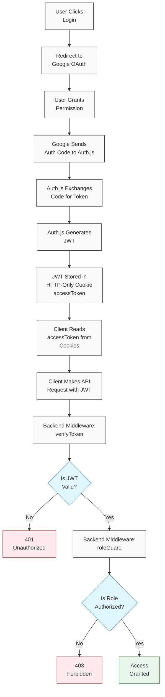

```mermaid
graph TD
    A["User Clicks<br>Login"] --> B["Redirect to<br>Google OAuth"]
    B --> C["User Grants<br>Permission"]
    C --> D["Google Sends<br>Auth Code to Auth.js"]
    D --> E["Auth.js Exchanges<br>Code for Token"]
    E --> F["Auth.js Generates<br>JWT"]
    F --> G["JWT Stored in<br>HTTP-Only Cookie<br>accessToken"]
    G --> H["Client Reads<br>accessToken from<br>Cookies"]
    H --> I["Client Makes API<br>Request with JWT"]
    I --> J["Backend Middleware:<br>verifyToken"]
    J --> K{"Is JWT<br>Valid?"}
    K -- No --> L["401<br>Unauthorized"]
    K -- Yes --> M["Backend Middleware:<br>roleGuard"]
    M --> N{"Is Role<br>Authorized?"}
    N -- No --> O["403<br>Forbidden"]
    N -- Yes --> P["Access<br>Granted"]

%% The following styles help with layout and formatting
classDef default fill:#f9f9f9,stroke:#333,stroke-width:1px;
classDef decision fill:#e1f5fe,stroke:#01579b,stroke-width:1px;
classDef error fill:#ffebee,stroke:#c62828,stroke-width:1px;
classDef success fill:#e8f5e9,stroke:#2e7d32,stroke-width:1px;

class K,N decision;
class L,O error;
class P success;
```
